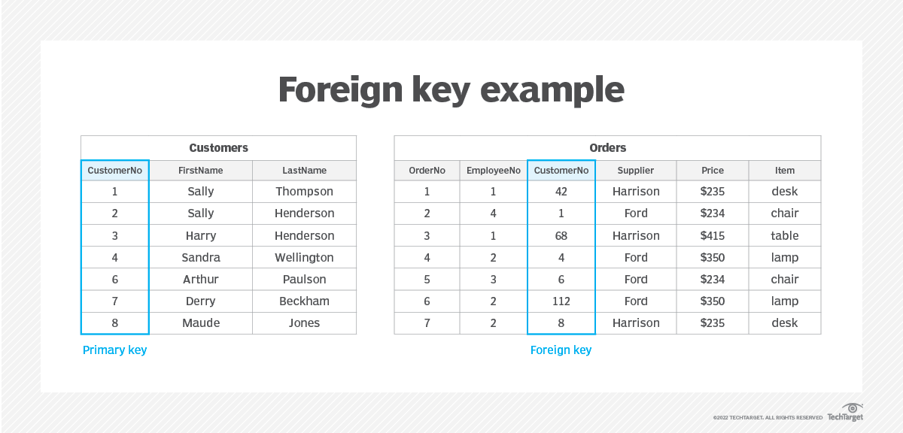

# Foreign Keys and JOINS

Foreign keys and JOINs are the basic SQL tools for creating and using relationships between tables.

A foreign key is a unique identifier that will allow to reference of one record into a another table.

Let's take the following example, let's say we have a database of customers and orders.

To connect the information of one Order to one Customer (and order that included a chair belongs to a customer named Sally) you will need an unique identifier for both: Order and Customer. Thoose numbers help to make the connection between information across different tables. It looks like this:



As you can see in the table Orders, Customer Number 1 (Sally Henderson in table Customers), made an order for a chair.

## Video: Linking Tables with Keys

This video illustrates linking the Primary key of one table with the Foreign key of another table:

<div class="embed"><iframe src="https://www.youtube.com/embed/B5r8CcTUs5Y" title="YouTube video player" frameborder="0" allow="accelerometer; autoplay; clipboard-write; encrypted-media; gyroscope; picture-in-picture; web-share" allowfullscreen></iframe></div>

## FOREIGN KEY

As we saw just before, **Foreign keys** are a way of linking data in two different tables in a relational database. They are used to establish a relationship between two tables, where the values in one table depend on the values in another table.

A foreign key is a column or set of columns in one table that refer to the primary key of another table. The purpose of a foreign key is to ensure data integrity, which means that the data in the database is consistent and accurate.

For example, consider a database that has two tables: a `customers` table and an `orders` table. The `customers` table contains information about customers, including a unique identifier for each customer, which is the primary key. The `orders` table contains information about the orders placed by each customer, including the customer's identifier. 

```sql
CREATE TABLE customers (
  id INTEGER PRIMARY KEY AUTOINCREMENT,
  name TEXT NOT NULL,
  email TEXT NOT NULL UNIQUE
);

CREATE TABLE orders (
  id INTEGER PRIMARY KEY AUTOINCREMENT,
  customer_id INTEGER NOT NULL,
  product TEXT NOT NULL,
  quantity INTEGER NOT NULL,
  FOREIGN KEY (customer_id) REFERENCES customers (id)
);
```

The `customer_id` column in the `orders` table is a foreign key. It refers to the primary key of the customers table. It tells us which customer the order belongs to.

The `FOREIGN KEY` statement is a _database constraint_. It creates a relationship between the two tables, where each order in the orders table must correspond to a customer in the customers table. If you try to insert an order into the orders table with a customer_id that doesn't exist in the customers table, you'll get an error.

