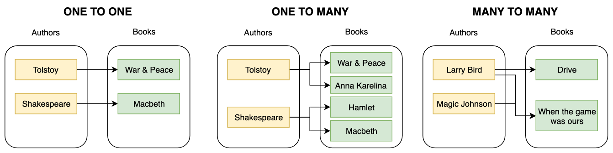

# One-to-many relationships

### What is a One-to-Many Relationship?

A one-to-many relationship between two entities (or tables) signifies that a single record in the first entity can relate to multiple records in the second entity. However, a record in the second entity can relate to only one record in the first entity.

For instance, consider the relationship between an `Author` and `Books`. An author can write multiple books, but each book has only one primary author. This relationship between an author and books is a one-to-many relationship.



### Characteristics

1. **Multiplicity**: One record in Table A can be associated with multiple records in Table B. However, each record in Table B can be associated with only one record in Table A.
2. **Foreign Key**: The table representing the "many" side (Table B) contains a foreign key that references the primary key of the "one" side (Table A).

### Implementation Guide

Using the "Author and Books" example, let's demonstrate a one-to-many relationship implementation in a relational database (using SQL as our guide).

#### Step 1: Create the Tables

We'll begin by creating the `Author` and `Book` tables:

```sql
CREATE TABLE Author (
    author_id INT PRIMARY KEY,
    name VARCHAR(100),
    birthdate DATE
);

CREATE TABLE Book (
    book_id INT PRIMARY KEY,
    title VARCHAR(200),
    publication_date DATE,
    author_id INT,
    FOREIGN KEY (author_id) REFERENCES Author(author_id)
);
```

In the structure above, `author_id` in the `Book` table acts as a foreign key that references `author_id` in the `Author` table.

#### Step 2: Inserting Data

Insert an author and their corresponding books:

```sql
INSERT INTO Author (author_id, name, birthdate) VALUES (1, 'J.K. Rowling', '1965-07-31');

INSERT INTO Book (book_id, title, publication_date, author_id) VALUES (201, 'Harry Potter and the Philosopher's Stone', '1997-06-26', 1);
INSERT INTO Book (book_id, title, publication_date, author_id) VALUES (202, 'Harry Potter and the Chamber of Secrets', '1998-07-02', 1);
```

#### Step 3: Querying Data

To fetch the titles of all books written by J.K. Rowling:

```sql
SELECT b.title
FROM Book b
JOIN Author a ON b.author_id = a.author_id
WHERE a.name = 'J.K. Rowling';
```

This will list all the books written by J.K. Rowling.