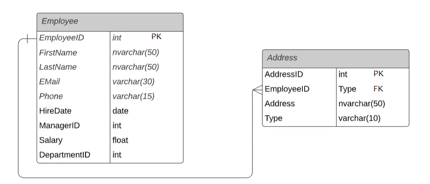
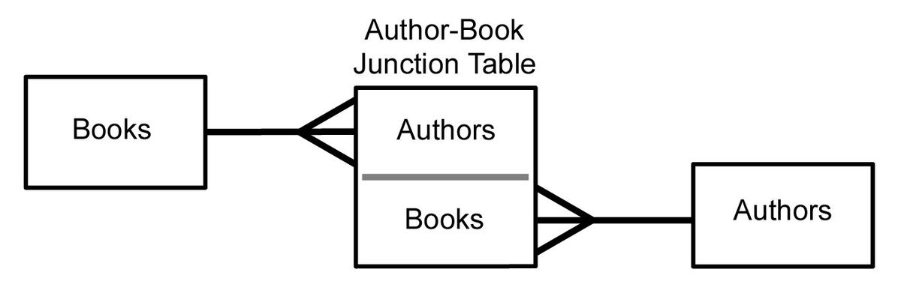

# Table relations

So far, our data has been simple. In the link shortener application, for instance, we had just one table. The full power of SQL shows when there are many related tables.

Picture the schema for a microblogging application like Twitter. What data does it store?

- Users
- Posts
- Likes
- Comments
- Follows
- Direct Messages
- ...probably many others!

If we store all this information in a single table, we would have a mess. It would be very hard to query information and organize it.

Why don't we split information in different tables and then connect them?

## Introducing Table Relationships. 

With this technique you will improve your database design skills. Let's explore.

### Types of Table Relationships:

1. **One-to-One (1:1) Relationship**:
   - Each row in the first table corresponds to one and only one row in the second table, and vice-versa.
   - Example: A country has one and only one capital, and each capital is linked to one and only one country.

   

2. **One-to-Many (1:N) or Many-to-One (N:1) Relationship**:
   - Each row in the first table can relate to many rows in the second table, but each row in the second table relates to one and only one row in the first table.
   - Example: One employee can have many addresses, and only one address can belong to one employee.

   
   

3. **Many-to-Many (M:N) Relationship**:
   - Each row in the first table can relate to many rows in the second table, and vice-versa.
   - This relationship is typically implemented using a join table (or bridge table).
   - Example: One author can write many books, and each book can have many authors.

   

### Problems Solved by Table Relationships:

1. **Data Duplication**: By setting up proper relationships, you ensure that each piece of data is stored once and then referenced elsewhere as needed.
   
2. **Maintaining Consistency**: Relationships ensure that related records in different tables correspond correctly to each other (i.e while editing information in tables, you make sure that the data is properly edited).
   
3. **Efficient Querying**: With the right relationships, complex queries can be simplified, and data retrieval can be made faster.

In the following lessons, we will explore in more detail how to implement this table relationships.