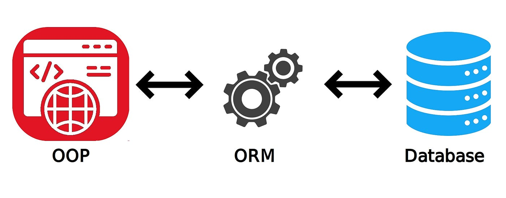

# What is an ORM?

ORM stands for **Object-Relational Mapping**. It's a tool that allows developers to interact with databases using the programming language of their choice, rather than raw SQL queries. Think of it as a bridge between the world of object-oriented programming and the world of relational databases.



Imagine we have a book store application with the following tables:

1. **Authors**: Storing author details.
2. **Books**: Storing book details, linked to authors.
3. **Orders**: Storing customer orders, linked to books.

We want to fetch all books written by a particular author that have been ordered more than 50 times.

### Raw SQL:

Using a raw SQL query, this might look something like:

```sql
SELECT Books.title, COUNT(Orders.id) AS order_count 
FROM Books
JOIN Authors ON Books.author_id = Authors.id
JOIN Orders ON Books.id = Orders.book_id
WHERE Authors.name = 'J.K. Rowling'
GROUP BY Books.title
HAVING COUNT(Orders.id) > 50;
```

This SQL query joins the three tables, filters by the author's name, groups by book titles, and counts orders to filter out books ordered more than 50 times.

---

### Using an ORM (like prisma):

Using Prisma, this might be approached differently.

```javascript
const books = await prisma.book.findMany({
  where: {
    author: {
      name: 'J.K. Rowling'
    },
    orders: {
      _count: {
        gt: 50
      }
    }
  },
  select: {
    title: true,
    _count: {
      select: { orders: true }
    }
  }
});
```

### Differences:

1. **Syntax**: The raw SQL query requires knowledge of SQL syntax, joins, grouping, and filtering. Prisma's query, on the other hand, uses a more JavaScript-centric approach, which may feel more intuitive to JS developers.

2. **Abstraction**: With Prisma, the focus is on the data's shape and the relationships between entities, abstracting away the SQL layer. This makes it more maintainable and readable, especially for those who aren't SQL experts.

3. **Flexibility**: Both methods provide flexibility. Raw SQL might offer more fine-tuned control for complex queries, while Prisma offers a more structured and type-safe approach.

4. **Type Safety**: With Prisma, the queries are type-checked, which means you can catch potential issues at compile time rather than runtime.
