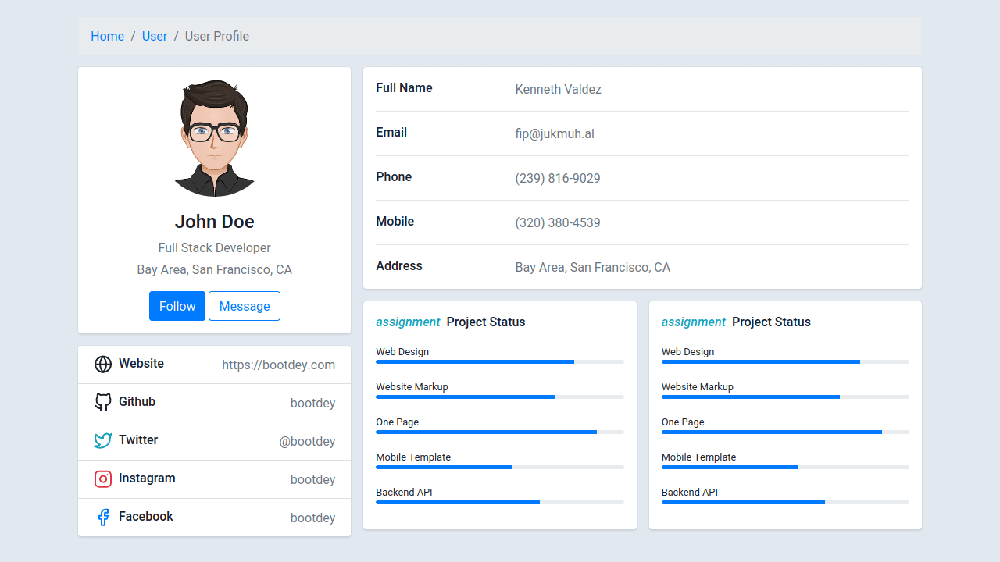

# What are templates?

At its core, a template is a pre-designed file that serves as a starting point for a new document. Think of it as a mold into which you can pour content to shape it in a specific way. In the context of web development, templates allow developers to separate the design of a web page from its content (and logic). They provide placeholders that can be dynamically populated with actual content at runtime.

For instance, you might have a website with user profiles. Instead of creating a separate HTML page for each user (impractical and cumbersome), you'd have a single template. This template would contain placeholders for user-specific data, such as name, profile picture, and bio. When a user visits their profile page, the template is filled with their specific data, giving the illusion of a unique page for each user.



#### Why Do We Need Templates?

1. **Separation of Concerns:** Templates allow for a clear separation between the presentation layer (how the content looks) and the business logic (how data is processed). This makes code easier to maintain, understand, and scale.
  
2. **Efficiency and Reusability:** Instead of creating new pages from scratch or duplicating code, developers can reuse the same template across multiple parts of an application or even across different projects.

3. **Flexibility:** Templates can be dynamically populated based on user input, database queries, or other data sources. This enables the creation of highly customized user experiences.

#### Why Are Templates Helpful?

1. **Consistency:** By using templates, you ensure a consistent look and feel across your website or application. Any changes made to the template will be reflected across all pages that use it.

2. **Rapid Development:** Templates significantly speed up the development process. Developers can focus on the logic and functionality of the application, knowing the presentation is handled.

3. **Easier Maintenance:** If you need to change a design element (like a button color), doing so in the template will automatically update all associated pages.

#### Templates in Flask

Here is a very simple example on how to implement a template using Flask.

```python
from flask import Flask, render_template

app = Flask(__name__)

@app.route('/profile/<username>')
def profile(username):
    return render_template('profile.html', name=username)
```

In the above code, when someone visits `/profile/John`, Flask will look for a `profile.html` template. This template might look something like:

```html
<html>
    <head>
        <title>Profile</title>
    </head>
    <body>
        <h1>Welcome, {{ name }}!</h1>
        <p>This is your profile page.</p>
    </body>
</html>
```

The `{{ name }}` in the template is a placeholder, which Flask will replace with the actual `username` - in this case, "John".