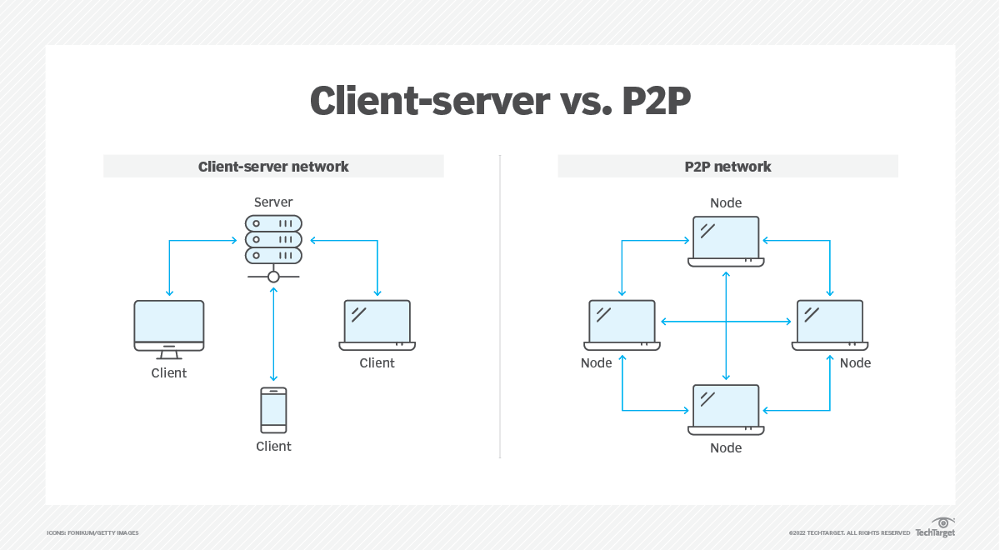

# Web Application Architecture

Web applications typically follow a *client-server architecture*. 

The client is the web browser that the user interacts with, and the server is 
the remote computer that hosts the web application. The server serves content 
and functionality to the client.

On the web, the client and server communicate with each other using the HTTP 
protocol, which defines how requests and responses are formatted and handled.

> This video explains in detail this client-server architecture.

<iframe src="https://www.youtube.com/embed/L5BlpPU_muY" frameborder="0" webkitallowfullscreen mozallowfullscreen allowfullscreen style="position: absolute; top: 0; left: 0; width: 100%; height: 100%;"></iframe>

>  ### Key Ideas
> - The web is a service built on top of the Internet, enabling computers to share and exchange data such as images, videos, documents, etc. This communication system is often referred to as the client-server model.
> - A client in this model can be a machine or a program. Client machines are the devices that end-users use to access the web, including laptops, desktops, smartphones, and tablets. A client program, on the other hand, is a program that allows users to make requests through the web, such as web browsers or software applications that access online resources.
> - A server, in contrast to a client, is specifically a computer program. Servers are often defined as high-performance computers, but they are termed so because they run server programs that serve requests from clients and because they operate on server operating systems. Servers are designed to run 24/7 and often require powerful hardware to handle multiple client requests simultaneously.
> - In the client-server model, servers can serve multiple clients at the same time. A single server can host web resources, web applications, user and program data, and much more. It listens for requests from clients and responds with a message when a request is received.
> - This communication between clients and servers happens through a request-response cycle, often using HTTP messages.
> - Besides the client-server model, another way for computers to communicate on the web is through a decentralized architecture called the peer-to-peer model. In this model, there is no distinct client or server; both computers can be requesters and response providers.

## Check your understanding

1. In the client-server architecture, what is the client?
2. What is the role of the server in the client-server architecture?
3. What protocol do the client and server use to communicate with each other?
4. Can a client be both a machine and a program? Give examples of each.
5. How are servers different from clients in the client-server model?
6. How does a server respond to client requests?
7. What is the role of HTTP messages in the communication between clients and servers?
8. What is the alternative to the client-server model for computers to communicate on the web?
9. In the peer-to-peer model, how are the computers different from those in the client-server model?